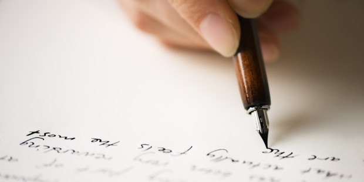

  <body>
    <h1><strong>글세상</strong></h1>

<ol>
   <li><a href="doggy file.html">글을 잘 쓰는 방법</a></li>
   <li>주의사항</li>
   <li>동기부여</li>
</ol>
    
   
소중한 한조를 위해서 열심히 살자! 당장 기분에 휘둘리지 말자!

</body>
</html>

<body>
  <h1>글을 잘 쓰는 방법</h1>
  

    <strong>빠른 실력향상:</strong>

       
      <ol><li>필사하기</li>
        

        타인이 쓴 좋은 글을 하루에 한 꼭지씩, 손으로 베껴써보자. 우리의 몸은 자연스럽게 좋은 문장의
           문법과 표현력을 습득할 것이다. 창조는 무에서 유를 창조하는 게 아니라 경험에서 우러나는
           것임을 잊지 말자. 손으로 직접 글을 쓰는 것은 타이핑하는 것보다 글을 머리속에 각인시키기에
           더욱 유리하다. 우리의 눈과 머리는 타이핑의 속도를 따라가지 못하기 때문이다. 입으로 글을 따라
           읽으며 쓰면 두 배 이상의 시너지를 낼 수 있으니 참고하기 바란다.

            

              <li>단어와 맞춤법에 능통해지기</li>

              

                단어는 글의 재료이다. 어떤 단어를 선별해서 쓰느냐가 필자의 문체를 결정한다.
                   적절한 단어의 선택은 글의 전달력을 높이고 글의 품위를 더해준다. 글을 쓰는 사람에게
                   올바른 단어사용은 필연적이니 평소에도 모르는 것들에 늘 관심을 가지도록 하자. 풍부한
                   지식이 곧 표현력으로 이어진다!

                    

                      <li>자신의 글을 첨삭하자</li>

                      

                        글을 완성시킨 뒤, 어색한 부분들을 고치는 작업을 여러번 반복한다. 그렇게 함으
                           로써 무의식적으로 형성된 잘못된 습관들을 정정할 수 있다.

                          

                            <li>단순한 문장을 구사하자</li>

                            

                              지나치게 길고 장황한 문장 구사는 가독성을 떨어뜨린다. 또한 한 문장에 주제가 두
                                 가지 이상 나타나면 전달하고자 하는 의미가 불분명해지므로 주의해야 한다. 수식 표현을
                                 주제 부분에만 붙이고 나머지는 과감하게 생략함으로써 전하고자 하는 내용을 명확히 하는
                                 요령이 필요하다.

                              </ol>
                              </body>
                              </html>
